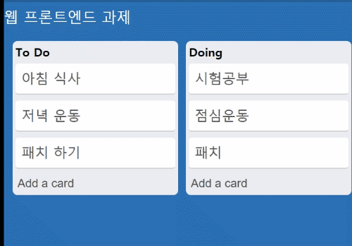

# Trello Clone HomeWork

Trello clone homework는 monorepo(client, server)로 구성되어있습니다.
모든 Component는 State와 Props를 기반으로 데이터를 관리하며 렌더링 됩니다.

## 주요 기능

- 새로운 리스트 생성
  

- 새로운 카드 생성
  

- 리스트 간 카드 이동 가능 (Drag & Drop)
  

- 서로 다른 클라이언트간 데이터 실시간 동기화 (Web Socket)
  client A | client B
  :-------------------------:|:-------------------------:
   | 

## 프로젝트 사용 기술

client-side

- Typescript
- Vanillajs
- Websocket
- HTML,CSS
- Font awesome

server-side

- Typescript
- express
- WS
- ts-node-dev

etc

- concurrently
- live server (vscode extention)

## 실행 방법

```
# install dependency
yarn

# start development
yarn start

# start Production
yarn build
```

## Browser

site is running at `http://localhost:3000`!

## 디렉토리 구조

```
packages/client/
│
├── public/                             -> 정적 파일
├── src/
│   ├── components/                     -> 컴포넌트 소스코드
│   │   ├── board/                      -> list,card의 전체 데이터를 관리 하는 컴포넌트
│   │   ├── card/
│   │   ├── common/                     -> 공용 컴포넌트
│   │   ├── core/                       -> 모든 Component의 core 컴포넌트
│   │   ├── form/                       -> Card,List 생성을 위한 컴포넌트
│   │   ├── header/
│   │   ├── nav/
│   │   └── list/
│   ├── lib/                            -> utli 코드
│   ├── types/                          -> typecript의 타입 선언 코드
│   ├── App.ts                          ->   메인 컴포넌트
│   └── index.ts                        -> Html page에 dom binding 하기 위한 entry 지점
│
├── package.json
├── tsconfig.json
```

```
packages/server/
│
│
├── src/
│   ├── board/
│   │   ├── board.entity.ts             -> board의 Model
│   │   ├── board.repository.ts         ->  board model의 Create, Read, Update
│   │   └── board.service.ts            -> board 비지니스 로직
│   ├── socket.ts                       -> websocket 서버 소스코드
│   ├── app.ts                          ->   express 서버 소스코드
│   └── index.ts                        -> 웹server와 소켓서버의 entry 지점
│
├── package.json
├── tsconfig.json
```

## License

Licensed under the MIT License.
